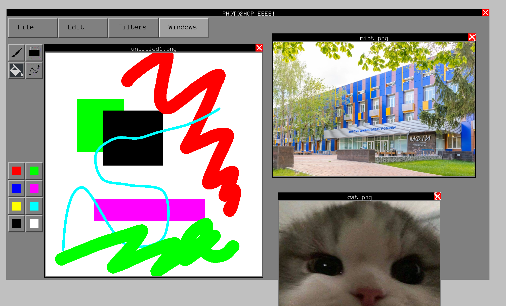

# Графический редактор
## Описание

Проект написан в ходе курса по ООП на C++.

Приложение позволяет редактировать изображения с помощью фильтров и инструментов.
Также можно написать свои инструменты и фильтры и динамически подключить их, не пересобирая всё приложение.



## Запуск

Перед сборкой нужно установить [SFML](https://www.sfml-dev.org/download.php)

```
make prepare
make app
./app
```
